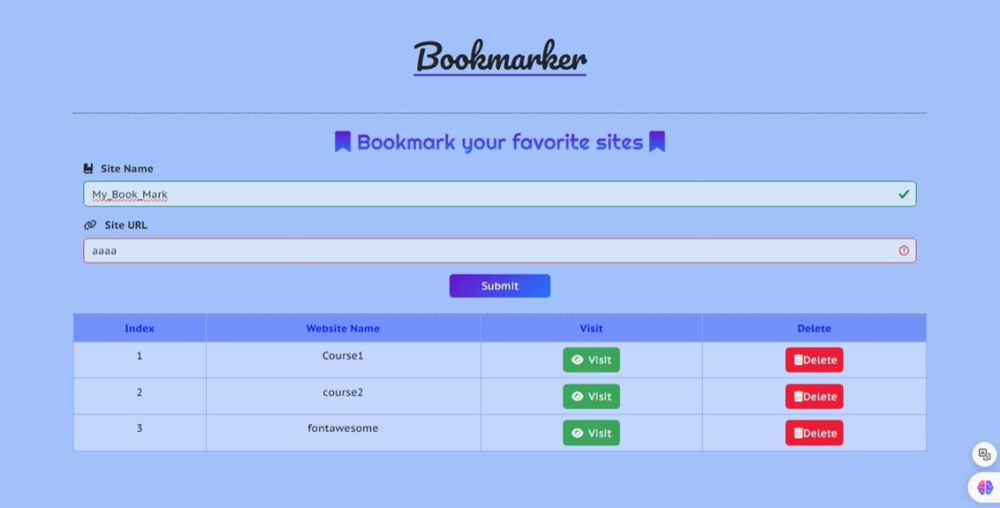

# Bookmarker

## Table of Contents
- [Overview](#overview)
- [Features](#features)
- [Technologies Used](#technologies-used)
- [Project Structure](#project-structure)
- [Contributing](#contributing)
- [Author](#author)
- [License](#license)

## Overview
Bookmarker is a web application that allows users to bookmark their favorite sites. Users can input the name and URL of the site they want to bookmark, and it will be displayed in a table format. The application also provides validation to ensure that the site name and URL are valid and do not duplicate existing entries.

## Features
- **Bookmarking**: Users can add their favorite sites by entering the site name and URL.
- **Validation**: Ensures that the entered site name has at least 3 characters and the URL is valid.
- **Display**: Displays bookmarked sites in a table with options to visit or delete them.
- **Alerts**: Alerts users if the site name or URL is invalid or if there is a duplicate entry.

## Demo

- You can Try out the App online [**From Here**](https://eng-ahmed-hussien.github.io/Bookmarker_App/)

## Technologies Used
- **HTML**: Structure of the application.
- **CSS**: Styling the application for visual appeal and responsiveness.
- **JavaScript**: Functionality and interactivity of the application.
- **Bootstrap**: CSS framework for layout and components.
- **Font Awesome**: Icons for visual representation.

## Project Structure
- `index.html`: Main HTML file containing the structure of the application.
- `assets/Css/style.css`: CSS file for custom styling.
- `assets/Js/script.js`: JavaScript file containing the application logic.
- `./readme-img.jpeg`: Image used in the README file.

## Contributing
Contributions are welcome! Fork the repository and submit a pull request.

## Author
- [Ahmed Hussien](https://github.com/Eng-Ahmed-Hussien)

## License
This project is licensed under the MIT License. See the [LICENSE](./LICENSE) file for details.
